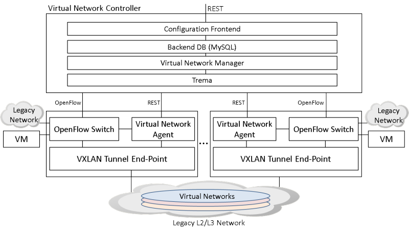
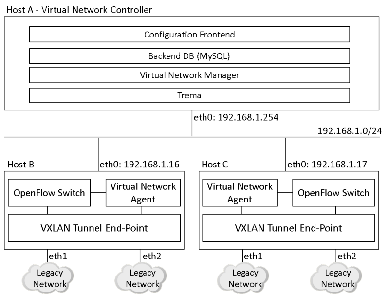

# What's this?

This is a software suite which allow you to construct and
manage VXLAN-based virtual networks with a single centralized
management point. The centralized management point provides a
REST-based interface for managing the virtual networks.

# How does it work?

VXLAN-based virtual networks are managed with the following
system architecture and software packages.

## System architecture

## Software packages
### Vritual Network Controller
Virtual Network Controller consists of the following tree
subcomponents.

1. Virtual Network Manager
Virtual Network Manager is an application responsible for
managing virtual networks. It retrieves configuration from
the backend database (see below for details) and make necessary
changes in OpenFlow switches and VXLAN tunnel endpoints. It acts
as an OpenFlow controller. It is developed on top of Trema
which is an OpenFlow framework for developing OpenFlow controllers
and switches.

2. Backend Database
Backend database stores virtual network configuration and operational
states of OpenFlow switches and Virtual Network Manager. It is a database
created on MySQL.

3. Configuration Frontend
Configuration Frontend provides a REST interface for managing
virtual networks. It works as a web server and allows you to
create/delete virtual networks, attach/detach switch ports to/from
virtual networks, associate/detach MAC addresses with/from switch
ports via the REST interface.

### Virtual Network Agent
Virtual Network Agent receives requests from Virtual Network Manager
to configure VXLAN tunnel endpoint and OpenFlow switch. It runs on
the same host as VXLAN tunnel endpoint and OpenFlow switch are running.

### VXLAN Tunnel End-Point
VXLAN Tunnel End-Point is a VXLAN tunnel endpoint implementation.
It can be a user space implementation included in this software
suite or standard Linux kernel implementation available on Linux
3.7.

### OpenFlow Switch
OpenFlow Switch is unmodified Open vSwitch (version 1.4.X).
It is not included in this software suite. For detailed information on
Open vSwitch, please visit http://openvswitch.org/.

# How to use?

## Prerequisite

At least, one host that runs Virtual Network Controller and two
hosts for Virtual Network Agent, VXLAN Tunnel End-Point, and
OpenFlow switch are required. The following operating systems
are only supported.

* Ubuntu 12.04.1 LTS Desktop (i386/amd64)

Operating systems other than above are totally not tested and may
not work expectedly.

## Setup

We assume that the software suite is installed in the following
environment.

### Virtual Network Controller
1. Virtual Network Manager

Since Virtual Network Manager is based on Trema, you need to build Trema
before building Virtual Network Manager.

1.1. Build Trema

  $ sudo apt-get install gcc make ruby rubygems ruby-dev libpcap-dev \
  libsqlite3-dev
  $ sudo gem install gli
  $ cd trema
  $ ./build.rb
  $ cd ..

1.2. Build Virtual Network Manager

  $ sudo apt-get install libcurl4-gnutls-dev libjson0-dev libmysqlclient-dev
  $ cd virtual_network_manager/src
  $ make
  $ cd ../..

1.3. Setup init script

  $ sudo cp virtual_network_manager/init/virtual_network_manager /etc/init.d
  $ sudo update-rc.d virtual_network_manager defaults

1.4. Setup configuration file

  $ sudo cp virtual_network_manager/config/virtual_network_manager /etc/default

Edit the configuration file (/etc/default/virtual_network_manager) as follows:

  (TBD)

2. Backend Database

2.1. Install MySQL server and client

  $ sudo apt-get install mysql-server mysql-client

During the installation process, you may be asked to set a root's password.
We assume here that the password is set to "root123".

2.2. Edit /etc/my.cnf as follows:

  ...
  bind-address            = 127.0.0.1
  ...

2.3. Add privileges to "root"

  $ mysql -u root --password=root123
  mysql> grant all privileges on *.* to root@localhost identified by 'root123'
  with grant option;
  mysql> flush privileges;

2.4. Create database and tables

  $ cd backend_database
  $ ./create_database.sh
  $ cd ..

3. Configuration Frontend

3.1. Install Sinatra and ActiveRecord

  $ sudo apt-get install ruby-sinatra ruby-activerecord

3.2. Setup init script

  $ sudo cp configuration_frontend/init/configuration_frontend /etc/init.d
  $ sudo update-rc.d configuration_frontend defaults

3.3. Setup configuration file

  $ sudo cp configuration_frontend/config/configuration_frontend /etc/default

Edit the configuration file (/etc/default/configuration_frontend) as follows:

  (TBD)

4. Start all required services

  $ sudo service mysql restart
  $ sudo service virtual_network_manager start
  $ sudo service configuration_frontend start

### Virtual Network Agent

1. Install Sinatra

  $ sudo apt-get install ruby-sinatra

2. Setup init script

  $ sudo cp virtual_network_agent/init/virtual_network_agent /etc/init.d
  $ sudo update-rc.d virtual_network_agent defaults

3. Setup configuration file

  $ sudo cp virtual_network_agent/config/virtual_network_agent /etc/default

Edit the configuration file (/etc/default/virtual_network_agent) as follows:

  (TBD)

4. Start Virtual Network Agent

  $ sudo service virtual_network_agent start

### OpenFlow Switch (Open vSwitch)

1. Install Open vSwitch

  $ sudo apt-get install openvswitch-switch openvswitch-datapath-dkms

3. Create switch instance and add switch ports

  $ sudo ovs-vsctl add-br br0
  $ sudo ovs-vsctl add-port br0 eth1
  $ sudo ovs-vsctl add-port br0 eth2
 
3. Set datapath identifier and OpenFlow controller

Datapath id must be a 64-bit unique identifier for specifying the switch
instance. You need to assign a unique identifier for each switch instance.
Note hat datapath id may be specified with 16 digits hexadecimal without
"0x" prefix.

  $ sudo ovs-vsctl set Bridge br0 other-config:datapath-id=[datapath id in hex]
  $ sudo ovs-vsctl set-controller br0 tcp:192.168.16.254
  $ sudo ovs-vsctl set-fail-mode br0 secure

4. Restart Open vSwitch

  $ sudo service openvswitch-switch restart

### VXLAN Tunnel End-Point

1. Build VXLAN Tunnel End-Point

  $ cd vxlan_tunnel_endpoint/src
  $ make
  $ cd ../..

2. Setup init script

  $ sudo cp vxlan_tunnel_endpoint/init/vxland /etc/init.d
  $ sudo update-rc.d vxland defaults

3. Setup configuration file

  $ sudo cp vxlan_tunnel_endpoint/config/vxland /etc/default

Edit the configuration file (/etc/default/vxland) as follows:

  (TBD)

4. Start VXLAN Tunnel End-Point

  $ sudo service vxland start

## How to manage virtual networks?

Here are simple examples that show how to manage virtual networks.
Please see files under doc/api for extended examples.

1. Create a virtual network

  $ curl -v -H "Accept: application/json" -H "Content-type: application/json" \
  -X POST -d '{ "id": 128, "description": "Virtual network #128" }' \
  http://192.168.16.254/networks

2. Associate a switch port with a virtual network

  $ curl -v -H "Accept: application/json" -H "Content-type: application/json" \
  -X POST -d '{ "id": 1, "datapath_id": "1", "name": "eth1", "vid": 65535,
  "description": "eth1 on switch #1" }' \
  http://192.168.16.254/networks/128

3. Associate a MAC address with a switch port

  $ curl -v -H "Accept: application/json" -H "Content-type: application/json" \
  -X POST -d '{ "address" : "00:00:00:00:00:01" }' \
  http://192.168.16.254/networks/128/ports/1

# License & Terms
All software packages distributed here are licensed under the GNU
General Public License version 2.0:

http://www.gnu.org/licenses/gpl-2.0.html
